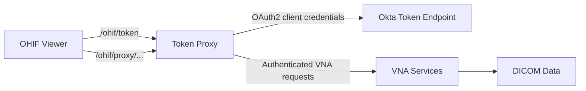

# Token Proxy Implementation for OHIF-VNA OAuth2 Integration

## Overview
This document describes the token proxy used by OHIF Viewer to access rpvna-dev via OAuth2 client credentials. The proxy keeps credentials out of the browser, manages token lifecycle, and injects authorization headers for VNA requests.

Namespace: `ohif-ac`  
Services: `token-proxy-service`, `ohif-rpvna-dev-viewer-service`

## Architecture


## Token Proxy Service
The proxy is a Node.js Express app that:
- Requests OAuth tokens from Okta using client credentials.
- Caches tokens in memory with a refresh buffer.
- Proxies VNA requests and injects `Authorization` plus required headers.
- Rewrites paths for internal cluster routing when needed.

### Key Configuration
```javascript
{
  tokenUrl: 'https://ciam-radpartners.oktapreview.com/oauth2/ausi5i8tqwLfitWSI1d7/v1/token',
  clientId: '0oahv72jg6XGpk4Gd1d7',
  clientSecret: '<from secret>',
  scope: 'stream-dicom',
  port: 3000,
  defaultTokenTtl: 3300,
  expiryBuffer: 300,
  enableProxy: true
}
```

## Token Cache Flow
1. Request arrives at `/token` or `/proxy/...`.
2. Cache is checked for a valid token.
3. If missing or near expiry, a new token is fetched and cached.
4. Token is injected as `Authorization: Bearer <token>` and the request is forwarded.

## Proxy Endpoints
### Token
```
GET /token
```
Response:
```json
{
  "access_token": "<token>",
  "token_type": "Bearer",
  "expires_in": 3300,
  "scope": "stream-dicom"
}
```

### VNA Proxy
```
GET /proxy/:env/*path
```
Example:
```
GET /proxy/rpvna-dev/rp/vna/query/studies
```

The proxy rewrites the path when using internal cluster DNS so the VNA service receives `/rp/vna/...` without the environment prefix.

## OHIF Integration
OHIF is configured to use the proxy routes. All VNA calls are routed through `/ohif/proxy/...` and token retrieval is via `/ohif/token`.

```javascript
qidoRoot: '/ohif/proxy/rpvna-dev/rp/vna/query',
wadoRoot: '/ohif/proxy/rpvna-dev/rp/vna/retrieve',
wadoUriRoot: '/ohif/proxy/rpvna-dev/rp/vna/retrieve'
```

OHIF request headers are provided via `requestOptions.headers`. The proxy overrides `Authorization`, `Accept`, `Content-Type`, and `Rp-Vna-Site-Id` as needed.

## Kubernetes Resources
Resources are deployed in `ohif-ac`.

| Resource | Name | Notes |
| --- | --- | --- |
| Deployment | `token-proxy` | Node.js service on port 3000 |
| Service | `token-proxy-service` | ClusterIP, port 3000 |
| Deployment | `ohif-rpvna-dev-viewer` | Nginx-based OHIF viewer |
| Service | `ohif-rpvna-dev-viewer-service` | ClusterIP, port 80 |
| ConfigMap | `ohif-rpvna-dev-config-local` | OHIF config |

## Environment Variables
```yaml
OAUTH_TOKEN_URL: 'https://ciam-radpartners.oktapreview.com/oauth2/ausi5i8tqwLfitWSI1d7/v1/token'
OAUTH_CLIENT_ID: '0oahv72jg6XGpk4Gd1d7'
OAUTH_CLIENT_SECRET: '<from secret>'
OAUTH_SCOPE: 'stream-dicom'
PORT: 3000
TOKEN_CACHE_TTL: 3300
TOKEN_EXPIRY_BUFFER: 300
CACHE_CLEANUP_INTERVAL: 600
ENABLE_AUTH: 'false'
ENABLE_PROXY: 'true'
VNA_BASE_URL: 'https://rp.dev.aws.radpartners.com/rpvna-dev'
LOG_LEVEL: 'info'
```

## Testing
### Token
```bash
curl -sS http://localhost:3000/token | jq
```

### VNA Query Through Proxy
```bash
curl -sS "http://localhost:3000/proxy/rpvna-dev/rp/vna/query/studies?limit=2" | jq
```

### End-to-End (Port Forwards)
```bash
kubectl port-forward -n ohif-ac svc/token-proxy-service 3000:3000 &
kubectl port-forward -n ohif-ac svc/ohif-rpvna-dev-viewer-service 8080:80 &
```

Open:
```
http://localhost:8080
```

## Troubleshooting
- 401 from VNA: token invalid or expired; verify client credentials and scope.
- 503 on `/token`: Okta unreachable or invalid credentials.
- 404 on proxy: incorrect environment prefix or path.
- Empty study list: verify proxy works with curl and confirm OHIF config values.

## Deployment Steps
```bash
kubectl apply -f TokenProxy/token-proxy.yaml -n ohif-ac
kubectl apply -f ohif-rpvna-dev-local-proxy.yaml -n ohif-ac
kubectl rollout restart deployment/ohif-rpvna-dev-viewer -n ohif-ac
kubectl rollout status deployment/ohif-rpvna-dev-viewer -n ohif-ac --timeout=120s
```

## References
- `token-proxy-service.js`
- `TokenProxy/token-proxy.yaml`
- `TokenProxy/token-proxy-virtualservice.yaml`
- `ohif-rpvna-dev-local-proxy.yaml`
- `test-token-proxy.sh`
- `test-vna-full.sh`
